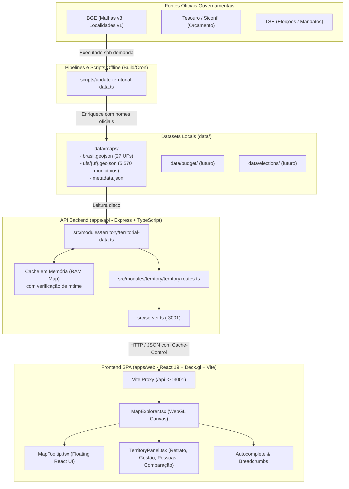

# Documentação do Projeto: Observatório Econômico (Observatório Brasil)

> Plataforma orientada a mapa para exploração, visualização e inteligência de dados públicos territoriais, socioeconômicos, fiscais e eleitorais do Brasil.

---

## Sumário

1. [Visão Geral e Princípios Arquiteturais](#1-visão-geral-e-princípios-arquiteturais)
2. [Arquitetura do Sistema](#2-arquitetura-do-sistema)
   - [Diagrama de Fluxo de Dados](#diagrama-de-fluxo-de-dados)
   - [Topologia de Pastas (Monorepo)](#topologia-de-pastas-monorepo)
   - [Estratégia de Domínio vs MVC](#estratégia-de-domínio-vs-mvc)
3. [Tudo o que Já Foi Feito e Está Pronto](#3-tudo-o-que-já-foi-feito-e-está-pronto)
   - [Pipeline e Ingestão de Dados Territoriais](#31-pipeline-e-ingestão-de-dados-territoriais)
   - [Backend (API Territorial Express)](#32-backend-api-territorial-express)
   - [Frontend (Interface do Mapa e Deck.gl)](#33-frontend-interface-do-mapa-e-deckgl)
   - [Design System e Experiência do Usuário (UI/UX)](#34-design-system-e-experiência-do-usuário-uiux)
4. [Especificação das Rotas da API](#4-especificação-das-rotas-da-api)
5. [Como Rodar o Projeto Localmente](#5-como-rodar-o-projeto-localmente)
6. [Próximos Passos e Módulos Futuros](#6-próximos-passos-e-módulos-futuros)

---

## 1. Visão Geral e Princípios Arquiteturais

O **Observatório Econômico** nasceu para transformar dados públicos brasileiros (frequentemente dispersos em portais governamentais de difícil acesso) em uma experiência fluida, rápida, pedagógica e visualmente impactante, centrada no mapa interativo.

### Princípios Fundamentais de Engenharia

1. **Zero requisições a APIs externas em runtime**:
   O navegador do usuário e a API em produção **nunca** chamam diretamente o IBGE, TSE, Siconfi ou Banco Central. Fontes governamentais não oferecem garantias de SLA, são sujeitas a instabilidade e possuem regras de rate limit.
2. **Datasets Distribuídos e Versionados**:
   As fontes externas são tratadas como **datasets distribuídos** locais gerados por scripts offline (`scripts/`), auditáveis por metadados (`metadata.json`) e servidos diretamente pela infraestrutura da aplicação.
3. **Independência de Provedores de Mapas Comerciais**:
   Não são utilizados serviços pagos ou proprietários como Google Maps, Mapbox ou Carto. O mapa é desenhado via GPU com WebGL usando a biblioteca aberta [deck.gl](https://deck.gl/) diretamente sobre os arquivos GeoJSON processados.
4. **Performance de Hover O(1)**:
   A interação de passar o mouse sobre estados ou municípios não dispara nenhuma requisição de rede ou processamento pesado. O script de geração embutiu os nomes oficiais nos arquivos GeoJSON com antecedência.
5. **Chave Primária Territorial Única**:
   O código do IBGE (`codarea` de 2 dígitos para UF e 7 dígitos para municípios) é a chave de ligação comum que unificará território, indicadores, finanças e eleições.

---

## 2. Arquitetura do Sistema

### Diagrama de Fluxo de Dados



### Topologia de Pastas (Monorepo)

O projeto está organizado na seguinte estrutura:

```text
observatorio-economico/
├── apps/
│   ├── api/                     # Backend Node.js / Express em TypeScript
│   │   ├── src/
│   │   │   ├── modules/
│   │   │   │   └── territory/   # Módulo territorial (rotas e leitura de datasets)
│   │   │   │       ├── territorial-data.ts
│   │   │   │       └── territory.routes.ts
│   │   │   └── server.ts        # Ponto de entrada da API HTTP
│   │   ├── package.json
│   │   └── tsconfig.json
│   └── web/                     # Frontend SPA (React 19, Deck.gl, Vite)
│       ├── src/
│       │   ├── features/
│       │   │   └── map/         # Domínio do mapa interativo
│       │   │       ├── components/
│       │   │       │   ├── MapExplorer.tsx       # Componente mestre do mapa
│       │   │       │   ├── MapTooltip.tsx        # Tooltip customizado do cursor
│       │   │       │   ├── TerritoryPanel.tsx    # Painel lateral multifuncional
│       │   │       │   ├── map-explorer.css
│       │   │       │   └── territory-panel.css
│       │   │       ├── data/
│       │   │       │   └── capitais.ts           # Dicionário estático das 27 capitais
│       │   │       └── mapFeatures.ts            # Helpers de extração de GeoJSON
│       │   ├── examples/        # Protótipos e laboratório Deck.gl (não-produção)
│       │   ├── App.tsx
│       │   ├── main.tsx
│       │   └── index.css
│       ├── package.json
│       └── vite.config.ts
├── data/                        # Datasets locais gerados (ignorados no Git)
│   ├── maps/
│   │   ├── ufs/                 # GeoJSON de cada uma das 27 UFs (5.570 municípios)
│   │   ├── brasil.geojson       # GeoJSON consolidado das 27 UFs
│   │   ├── metadata.json        # Metadados de versão e integridade
│   │   └── .gitignore
│   ├── budget/                  # Reservado para dados de orçamento
│   ├── elections/               # Reservado para dados eleitorais
│   └── indicators/              # Reservado para indicadores socioeconômicos
├── packages/
│   ├── contracts/               # Contratos e tipos TypeScript compartilhados
│   │   └── README.md
│   ├── shared/                  # Utilitários compartilhados futuros
│   └── config/                  # Configurações compartilhadas futuras
├── scripts/
├── update-territorial-data.ts # Script de ingestão do IBGE (Malhas)
├── update-indicators-data.ts  # Script de ingestão de Indicadores (IBGE/SIDRA)
├── update-budget-data.ts      # Script de ingestão de Orçamento (Siconfi/Tesouro)
└── update-elections-data.ts   # Script de ingestão de Eleições e Mandatos (TSE)
├── docs/
│   ├── adr/                     # Architectural Decision Records
│   │   └── 0001-dataset-territorial-distribuido.md
│   ├── architecture/            # Visão geral da arquitetura
│   │   └── overview.md
│   └── data-sources/            # Catálogo e documentação de fontes
│       └── README.md
├── package.json                 # Orquestrador de scripts do monorepo
├── package-lock.json
└── DOCUMENTACAO.md              # Este documento
```

### Estratégia de Domínio vs MVC

Diferente de sistemas convencionais que agrupam todos os controllers em uma pasta e todos os models em outra, o Observatório adota **arquitetura por domínio funcional**:
- Um novo tema de produto (ex.: `territory`, `budget`, `elections`) tem sua lógica de backend encapsulada em `apps/api/src/modules/<nome>` e sua respectiva interface em `apps/web/src/features/<nome>`.
- Componentes e helpers pertencem exclusivamente à feature que os consome. Código genérico e compartilhado só sobe para camadas compartilhadas quando consumido por mais de dois domínios.

---

## 3. Tudo o que Já Foi Feito e Está Pronto

### 3.1. Pipeline e Ingestão de Dados Territoriais

- [x] **Script de ingestão autônomo** ([`scripts/update-territorial-data.ts`](file:///home/emersonjsc/Documentos/projetos/observatorio-economico/scripts/update-territorial-data.ts)):
  - Realiza o download das malhas das 27 Unidades Federativas diretamente da API de Malhas v3 do IBGE.
  - Realiza o download dos municípios de todas as 27 UFs (5.570 municípios ao todo).
  - **Enriquecimento prévio de dados**: a malha nativa do IBGE contém somente o código numérico (`codarea`). O script consulta a API de Localidades v1 do IBGE e injeta no GeoJSON o **nome oficial** do estado/município e a **sigla da UF**, dispensando qualquer busca complementar em runtime.
  - Suporte a parâmetros CLI:
    - `--only=11,31` (baixa apenas UFs específicas).
    - `--skip-municipios` (baixa apenas a malha nacional de UFs).
- [x] **Dataset territorial 100% gerado em disco**:
  - `data/maps/brasil.geojson` gerado e validado.
  - `data/maps/ufs/*.geojson` com as 27 UFs e 5.570 municípios gerados e validados.
  - `data/maps/metadata.json` com registro de data/hora, contagem de polígonos e versão do dataset.

### 3.2. Backend (API Territorial Express)

- [x] **Servidor HTTP Express 5 em TypeScript** ([`apps/api/src/server.ts`](file:///home/emersonjsc/Documentos/projetos/observatorio-economico/apps/api/src/server.ts)):
  - Execução via `tsx` em desenvolvimento com hot-reload e compilação limpa via `tsc`.
- [x] **Módulo Territorial** ([`apps/api/src/modules/territory/`](file:///home/emersonjsc/Documentos/projetos/observatorio-economico/apps/api/src/modules/territory/)):
  - Camada de serviço com **leitura em dois níveis (RAM -> Disco)**:
    - Um cache em memória (`Map<string, EntradaRam>`) mantém os arquivos GeoJSON já lidos.
    - O serviço inspeciona o `mtimeMs` (timestamp de modificação) do arquivo no disco antes de retornar a versão em RAM; caso o script de atualização regere o arquivo, o cache é invalidado automaticamente sem precisar reiniciar a aplicação.
  - Validação de entrada (sanitização de código de UF por expressão regular `/^\d{2}$/`).
  - Cabeçalhos de cache HTTP preparados para CDN e navegador (`Cache-Control: no-cache, stale-while-revalidate=604800`).
  - Tratamento de erros gracioso com respostas `503 Service Unavailable` caso os dados territoriais ainda não tenham sido gerados.

### 3.3. Frontend (Interface do Mapa e Deck.gl)

- [x] **Aplicação React 19 + TypeScript + Vite 8**:
  - Compilação rápida e bundle de produção funcional via Rollup/Vite.
  - Proxy configurado no Vite para repassar chamadas `/api` ao servidor na porta 3001.
- [x] **Motor Gráfico Deck.gl (`@deck.gl/react` v9)** ([`MapExplorer.tsx`](file:///home/emersonjsc/Documentos/projetos/observatorio-economico/apps/web/src/features/map/components/MapExplorer.tsx)):
  - Sem uso de mapas comerciais terceirizados; renderização direta de polígonos GeoJSON via WebGL na camada `GeoJsonLayer`.
  - **Três Regras de Visualização e Negócio**:
    1. **Regra da Câmera**: transições tridimensionais suaves com `FlyToInterpolator`. Ao selecionar um estado, a câmera inclina para `pitch: 42` e aproxima para `zoom: 6.4`. Ao selecionar um município, aproxima para `zoom: 9`.
    2. **Regra de Isolamento**: ao focar em um estado, os demais estados ganham tom escurecido atenuado (*muted*), permitindo que a malha do estado selecionado revele seus municípios. Ao selecionar um município, este se destaca com bordas e preenchimento ciano vibrante.
    3. **Lazy Loading Territorial**: os municípios de um estado só são requisitados e renderizados quando o usuário clica naquele estado específico.
  - **Destaque de Capitais em Tempo Real** ([`capitais.ts`](file:///home/emersonjsc/Documentos/projetos/observatorio-economico/apps/web/src/features/map/data/capitais.ts)):
    - Tabela de consulta $O(1)$ com os códigos IBGE das 27 capitais.
    - Polígonos das capitais recebem destaque âmbar/dourado sem necessidade de renderizar ícones pesados.
- [x] **Tooltip de Hover de Alta Precisão** ([`MapTooltip.tsx`](file:///home/emersonjsc/Documentos/projetos/observatorio-economico/apps/web/src/features/map/components/MapTooltip.tsx)):
  - Renderizado fora do canvas em camada React flutuante (`position: fixed`, `pointer-events: none`).
  - Algoritmo de clamping: reposicionamento dinâmico baseado no tamanho da viewport para que a caixa nunca seja cortada nas bordas da tela.
  - Exibe nome oficial, código IBGE, UF e badge especial para capitais.
- [x] **Sistema de Busca Integrado**:
  - Caixa de busca com auto-sugestão em tempo real.
  - Permite localizar rapidamente estados e municípios carregados, disparando o voo da câmera diretamente para o destino.
- [x] **Breadcrumbs de Navegação**:
  - Trilha visual contextual (`Brasil` > `[Estado]` > `[Município]`).
  - Permite descer e subir nos níveis territoriais com um clique, reajustando a visão da câmera.

### 3.4. Design System e Experiência do Usuário (UI/UX)

- [x] **Painel Territorial Lateral Multifuncional** ([`TerritoryPanel.tsx`](file:///home/emersonjsc/Documentos/projetos/observatorio-economico/apps/web/src/features/map/components/TerritoryPanel.tsx)):
  - Interface retrátil em estilo *Dark Glassmorphism* (fundo translúcido com `backdrop-filter: blur`).
  - Dividido em 4 abas estratégicas:
    - **Aba Retrato**: síntese do território em "30 segundos", indicadores preliminares de População, Economia e Sociedade, além do mapa de atores institucionais (Prefeitura, Vice, Câmara / Governo, Assembleia Legislativa) explicando as atribuições cívicas de cada órgão.
    - **Aba Gestão**: área estruturada para receitas, despesas e orçamento público municipal/estadual.
    - **Aba Pessoas**: área estruturada para os mandatos vigentes e fiscalização de representantes.
    - **Aba Comparar**: formulário interativo de seleção de múltiplos entes federativos para visualização comparativa sem rankings artificiais.
- [x] **Responsividade Mobile**:
  - Painel lateral converte-se automaticamente em uma gaveta inferior móvel (*bottom sheet*) em telas estreitas através de media queries refinadas.

---

## 4. Especificação das Rotas da API

Todas as rotas são servidas sob o prefixo `/api`:

| Método | Rota | Descrição | Resposta de Sucesso | Cache |
|---|---|---|---|---|
| `GET` | `/api/health` | Verificação de disponibilidade da aplicação | `{"status": "ok"}` | Nenhum |
| `GET` | `/api/maps/metadata` | Metadados do dataset territorial atual | Metadados JSON (data, contagem, versão) | `stale-while-revalidate` |
| `GET` | `/api/maps/states` | GeoJSON contendo os polígonos das 27 UFs | `FeatureCollection` das UFs com nomes e siglas | `stale-while-revalidate` |
| `GET` | `/api/maps/states/:uf/municipios` | GeoJSON contendo os municípios da UF informada | `FeatureCollection` dos municípios com nomes e UF | `stale-while-revalidate` |
| `GET` | `/api/indicators/metadata` | Metadados do dataset de indicadores | Metadados JSON | `stale-while-revalidate` |
| `GET` | `/api/indicators/brasil` | Indicadores do Brasil e das 27 UFs | `{ brasil, estados[] }` (população, PIB e PIB per capita) | `stale-while-revalidate` |
| `GET` | `/api/indicators/ufs/:uf` | Indicadores de todos os municípios da UF | `{ uf, anoPopulacao, anoPib, municipios[] }` | `stale-while-revalidate` |
| `GET` | `/api/indicators/municipios/:codarea` | Indicadores de um município (7 dígitos) | Indicadores do município | `stale-while-revalidate` |
| `GET` | `/api/indicators/pontos` | Municípios com PIB + centroide (camada de hexágonos) | `{ total, pontos[] }` | `stale-while-revalidate` |
| `GET` | `/api/budget/metadata` | Metadados do dataset orçamentário | Metadados JSON | `stale-while-revalidate` |
| `GET` | `/api/budget/brasil` | Finanças dos 26 estados + DF | `{ exercicio, estados[] }` | `stale-while-revalidate` |
| `GET` | `/api/budget/ufs/:uf` | Finanças dos municípios da UF | `{ uf, exercicio, municipios[] }` | `stale-while-revalidate` |
| `GET` | `/api/budget/municipios/:codarea` | Finanças de um município | Receita, despesa e gastos por área | `stale-while-revalidate` |
| `GET` | `/api/elections/metadata` | Metadados do dataset eleitoral | Metadados JSON | `stale-while-revalidate` |
| `GET` | `/api/elections/brasil` | Mandatos nacionais (presidente e vice) + Congresso | `{ anoEleicao, presidente, vicePresidente, congresso }` | `stale-while-revalidate` |
| `GET` | `/api/elections/estados/:uf` | Mandatos estaduais (governador, senadores, deputados) | `{ uf, sigla, governador, senadores[], deputadosFederais[] }` | `stale-while-revalidate` |
| `GET` | `/api/elections/ufs/:uf` | Mandatos municipais da UF | `{ uf, anoEleicao, municipios[] }` | `stale-while-revalidate` |
| `GET` | `/api/elections/municipios/:codarea` | Mandato de um município (prefeito, vice e vereadores) | `{ codareaIbge, prefeito, vicePrefeito, vereadores[] }` | `stale-while-revalidate` |
| `GET` | `/api/elections/composicao/brasil` | Cadeiras por partido (Câmara e Senado) + por estado | `{ camaras[], territorios[] }` | `stale-while-revalidate` |
| `GET` | `/api/elections/composicao/estados/:uf` | Cadeiras por partido (assembleia, bancada) + por município | `{ camaras[], territorios[] }` | `stale-while-revalidate` |
| `GET` | `/api/elections/composicao/municipios/:codarea` | Cadeiras da câmara municipal por partido | `{ camaras[] }` | `stale-while-revalidate` |

> Os três módulos (`indicators`, `budget`, `elections`) usam a mesma estratégia do
> módulo territorial: cache em RAM invalidado por `mtime` do arquivo, e o servidor
> nunca consulta as fontes externas em runtime.

#### Exemplo de Resposta de Metadados (`GET /api/maps/metadata`):
```json
{
  "updatedAt": "2026-09-13T07:32:10.329Z",
  "source": "IBGE — API v3 de Malhas Territoriais",
  "estados": 27,
  "municipios": 5570,
  "ufs": ["11", "12", "13", "...", "53"],
  "version": 1
}
```

---

## 5. Como Rodar o Projeto Localmente

### Pré-requisitos
- Node.js (versão 20 LTS ou superior recomendada).
- npm (versão 10 ou superior).

### Instalação

```bash
# Na raiz do projeto, instale as dependências:
npm install
```

### 1. Atualizar ou Gerar os Dados Territoriais (se necessário)

Caso o diretório `data/maps/` não possua os arquivos GeoJSON, execute o script de ingestão:

```bash
# Baixa e enriquece todas as 27 UFs e os 5.570 municípios
npx tsx scripts/update-territorial-data.ts

# Ou para um teste rápido, baixe apenas algumas UFs:
npx tsx scripts/update-territorial-data.ts --only=35,33,31
```

### 2. Rodar em Ambiente de Desenvolvimento

Para rodar o projeto, mantenha os dois serviços ativos em terminais separados:

```bash
# Terminal 1 — Inicia o backend Express (porta 3001)
npm run dev:api

# Terminal 2 — Inicia o frontend Vite (porta 5173)
npm run dev:web
```

Acesse a aplicação no navegador em: `http://localhost:5173`.

### 3. Build de Produção

O site publicado é **estático** — o frontend lê arquivos JSON já preparados e não
depende de servidor em produção:

```bash
npm run build:site       # gera apps/web/dist (~85 MB) — publique esta pasta
npm run preview:site     # confere o resultado em http://localhost:4173
```

Para validar apenas a tipagem e compilar API e Web, sem empacotar os dados:

```bash
npm run build
```

Instruções completas de hospedagem gratuita (Cloudflare Pages, GitHub Pages) estão em
[DEPLOY.md](DEPLOY.md).

---

## 6. Próximos Passos e Módulos Futuros

Estado atual: os módulos **Indicadores**, **Orçamento** e **Eleições** já estão
implementados e integrados à interface (abas Retrato, Gestão, Pessoas, Cadeiras e
Comparar, além da Politicopédia). O que resta:

1. **Cobertura do orçamento (Siconfi)**:
   - Hoje apenas a UF 11 foi ingerida; falta estender `update-budget-data.ts` às 27 UFs
     e aos municípios.
2. **Pacote de Contratos Compartilhados (`packages/contracts`)**:
   - Exportação de interfaces TypeScript compartilhadas entre `apps/api` e `apps/web`
     (ex: `TerritorySummary`, `IndicatorMetric`, `FiscalSummary`).
3. **Camada opcional de API**:
   - O `apps/api` (Express) permanece útil para desenvolvimento local, mas deixou de ser
     necessário em produção. Só voltaria a fazer sentido se os dados crescerem além do
     que faz sentido versionar no repositório.

