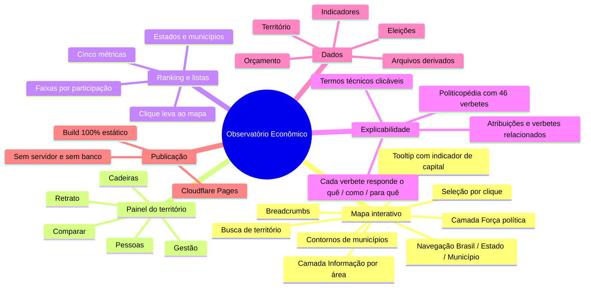
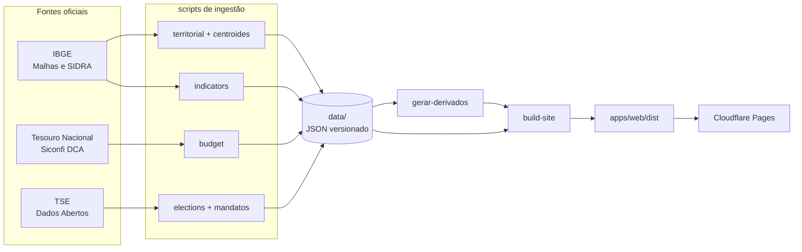
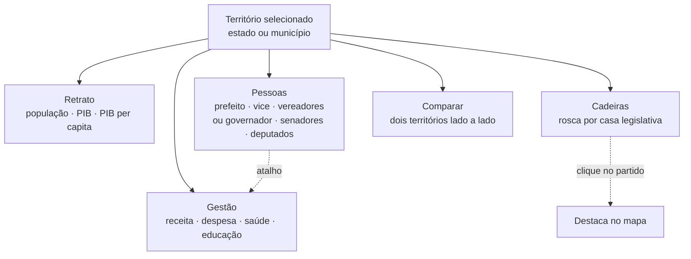
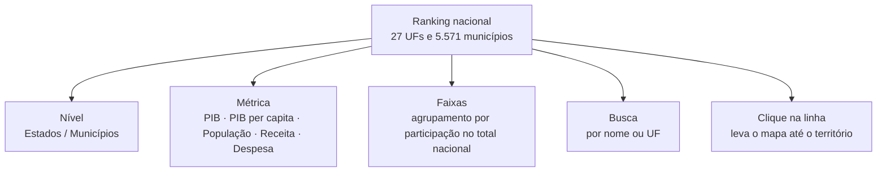

# Mapa de funcionalidades

Visão geral do que o Observatório Econômico faz hoje. Documento de referência curta —
para o detalhamento dos dados, veja o [README](../README.md).

> Última revisão: 2026-09-19

---

## 1. O site em um mapa

---

## 2. Como o dado chega até a tela

O `apps/api` existe apenas para desenvolvimento local e **não participa deste fluxo**.
Em produção o frontend lê os JSON diretamente.

---

## 3. As cinco abas do painel

| Aba | O que entrega | Fonte |
|---|---|---|
| **Retrato** | População, PIB total, PIB per capita, cada um com ano de referência | IBGE |
| **Gestão** | Receita realizada, despesa liquidada, gastos em saúde e educação com % da despesa | Tesouro / Siconfi |
| **Pessoas** | Mandatários com nome de urna, nome completo, partido e período; foto oficial com fallback para iniciais | TSE |
| **Cadeiras** | Rosca de composição partidária por casa; clicar num partido destaca no mapa | TSE |
| **Comparar** | Segundo território escolhido pelo usuário, lado a lado | todas |

---

## 4. Ranking e listas

Inspirado no livro de potências de Victoria 3: posição à esquerda, valor à direita e
agrupamento por faixa, que é o que dá noção de escala — sem ele, "R$ 40 bi" não
significa nada para quem lê.

| Elemento | Como funciona |
|---|---|
| **Agrupamento** | Métricas que somam são agrupadas por participação no total nacional; PIB per capita, que não é somável, por faixa de valor absoluto |
| **Barra** | Escala de raiz quadrada. Sem isso, a barra do 2º colocado ficaria invisível ao lado de São Paulo, que sozinho tem 9% do PIB |
| **Percentual** | Só aparece nas métricas aditivas — mostrar "% do total" de um valor per capita seria enganoso |
| **Paginação** | 100 linhas por vez, com "mostrar mais" |
| **Total e máximo** | Calculados sobre a base inteira, nunca sobre o filtro: senão a barra mudaria de escala a cada letra digitada |

Dados em `data/indicators/ranking.json`, gerado no build.

---

## 5. Camadas do mapa

| Camada | O que faz |
|---|---|
| **Nenhuma** | Estado em foco com contornos; ao selecionar um estado, os municípios ganham contorno |
| **Força política** | Legenda com os partidos e o número de cadeiras. Ao escolher um partido, cada território é colorido pela fatia de cadeiras que ele ocupa ali |
| **Informação** | Lente de dados por categoria. Totais (PIB, receita, despesa, população, saúde e educação) são somados em hexágonos 3D; métricas relativas (PIB per capita, densidade e valores por habitante) pintam os territórios. A escala pode ser ajustada por percentil; hexágonos também permitem ajustar o raio e a cobertura. |

Interações transversais: busca com autocomplete, navegação hierárquica com
breadcrumbs, retorno ao Brasil inteiro, câmera voando para o território escolhido,
tooltip no hover e seleção por clique no estado e depois no município.

---

## 6. Cobertura dos dados

| Bloco | Cobertura | Período |
|---|---|---|
| Malhas territoriais e centroides | 27 UFs, 5.570 municípios | — |
| População | 27 UFs, 5.571 registros | 2024 |
| PIB total e per capita | 27 UFs, 5.571 registros | 2021 |
| Orçamento | 27 UFs, 5.558 municípios | 2023 |
| Eleições municipais | 26 UFs, 5.546 municípios | 2024 |
| Eleições gerais | 27 UFs + Brasil | 2022 |

---

## 7. O que ainda **não** existe

Lista honesta, para não confundir o que está pronto com o que está planejado:

| Ausente | Observação |
|---|---|
| Série histórica | Cada indicador tem um único ano; não há gráfico de evolução |
| Compartilhar link do território | O território selecionado não vai para a URL |
| Exportar dados | Não há download em CSV ou similar |
| Comparar mais de dois territórios | A aba Comparar aceita exatamente dois |
| Outras funções orçamentárias | Só saúde e educação |
| Dados de contratos, licitações e servidores | Fora do escopo até agora |
| Atualização automática | A ingestão é manual; o site só muda quando o build roda |

---

## 8. Onde mexer em cada coisa

| Quero mudar | Vá para |
|---|---|
| Mapa, camadas, busca | `apps/web/src/features/map/components/MapExplorer.tsx` |
| Abas e cards do painel | `apps/web/src/features/map/components/TerritoryPanel.tsx` |
| Ranking e listas | `apps/web/src/features/ranking/Ranking.tsx` |
| Textos explicativos e verbetes | `apps/web/src/features/educacao/explicacoes.ts` |
| Cores dos partidos | `apps/web/src/features/elections/coresPartidos.ts` |
| Leitura dos JSON pelo front | `apps/web/src/lib/fontes.ts` |
| Ingestão de um bloco de dados | `scripts/update-*.ts` |
| Build e publicação | `scripts/build-site.ts` e [DEPLOY.md](../DEPLOY.md) |
