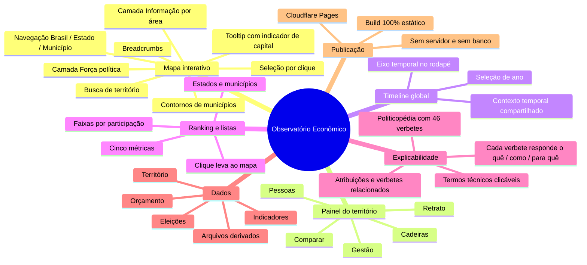
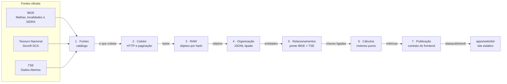
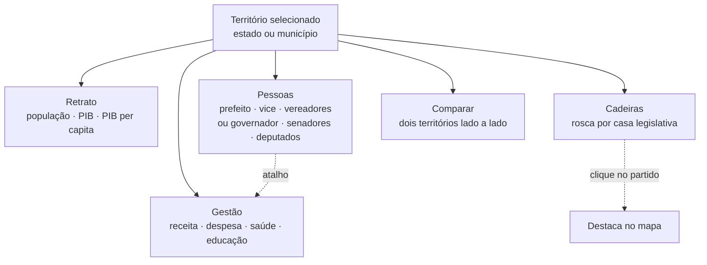
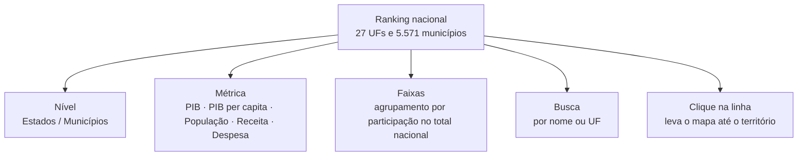

# Mapa de funcionalidades

Visão geral do que o Observatório Econômico faz hoje. Documento de referência curta —
para o detalhamento dos dados, veja o [README](../README.md).

> Última revisão: 2026-09-19

---

## 1. O site em um mapa

---

## 2. Como o dado chega até a tela

O dado atravessa sete caixas independentes. Cada uma só conversa com a vizinha:
nenhuma caixa lê a fonte diretamente nem calcula o que pertence a outra.

O navegador **nunca** chama IBGE, TSE, Siconfi ou Banco Central: lê apenas os
arquivos de `data/published/` por meio de `apps/web/src/lib/fontes.ts`.

### Nomes de arquivo por UF: sigla e código

A publicação usa as duas formas, e confundi-las faz o navegador pedir um arquivo
que não existe (404 silencioso — a tela fica sem dado e não dá erro):

| Shard | Nomeado por | Exemplo |
|---|---|---|
| `indicadores/{SIGLA}.json` | sigla | `MG.json` |
| `orcamento/{SIGLA}.json` | sigla | `MG.json` |
| `territorios/{CODIGO}.geojson` | código de 2 dígitos | `31.geojson` |
| `eleicoes/ufs/{CODIGO}.json` | código de 2 dígitos | `31.json` |

A conversão código → sigla mora em um único lugar, `siglaDaUf()` em
`apps/web/src/lib/fontes.ts`. Antes havia uma cópia da tabela por feature, e a
divergência entre elas é o que fazia o painel pedir `indicadores/31.json`.

---

## 3. As cinco abas do painel

| Aba | O que entrega | Fonte |
|---|---|---|
| **Retrato** | População, PIB total, PIB per capita, cada um com ano de referência | IBGE |
| **Gestão** | Receita realizada, despesa liquidada, gastos em saúde e educação com % da despesa | Tesouro / Siconfi |
| **Pessoas** | Mandatários com nome de urna, nome completo, partido e período; foto oficial com fallback para iniciais | TSE |
| **Cadeiras** | Rosca de composição partidária por casa; clicar num partido destaca no mapa | TSE |
| **Comparar** | Segundo território escolhido pelo usuário, lado a lado | todas |

---

## 4. Ranking e listas

Inspirado no livro de potências de Victoria 3: posição à esquerda, valor à direita e
agrupamento por faixa, que é o que dá noção de escala — sem ele, "R$ 40 bi" não
significa nada para quem lê.

| Elemento | Como funciona |
|---|---|
| **Agrupamento** | Métricas que somam são agrupadas por participação no total nacional; PIB per capita, que não é somável, por faixa de valor absoluto |
| **Barra** | Escala de raiz quadrada. Sem isso, a barra do 2º colocado ficaria invisível ao lado de São Paulo, que sozinho tem 9% do PIB |
| **Percentual** | Só aparece nas métricas aditivas — mostrar "% do total" de um valor per capita seria enganoso |
| **Paginação** | 100 linhas por vez, com "mostrar mais" |
| **Total e máximo** | Calculados sobre a base inteira, nunca sobre o filtro: senão a barra mudaria de escala a cada letra digitada |

Dados em `data/indicators/ranking.json`, gerado no build.

---

## 5. Camadas do mapa

| Camada | O que faz |
|---|---|
| **Nenhuma** | Estado em foco com contornos; ao selecionar um estado, os municípios ganham contorno |
| **Força política** | Legenda com os partidos e o número de cadeiras. Ao escolher um partido, cada território é colorido pela fatia de cadeiras que ele ocupa ali |
| **Informação** | Lente de dados por categoria. Totais (PIB, receita, despesa, população, saúde e educação) são somados em hexágonos 3D; métricas relativas (PIB per capita, densidade e valores por habitante) pintam os territórios. A escala pode ser ajustada por percentil; hexágonos também permitem ajustar o raio e a cobertura. |

Interações transversais: busca com autocomplete, navegação hierárquica com
breadcrumbs, retorno ao Brasil inteiro, câmera voando para o território escolhido,
tooltip no hover e seleção por clique no estado e depois no município.

### Tooltip do mapa

Em **Informação**, o popup do hover mostra o valor real da lente ativa — não um
texto fixo. Ele traz o nome do território, o código IBGE, o valor formatado
(ex.: `R$ 44,2 mi`) e o **ano de referência** de cada indicador.

O ano aparece porque as métricas têm anos diferentes — população e PIB de 2021,
orçamento de 2023. Omiti-lo sugeriria uma comparação válida entre valores de
exercícios distintos.

Quando a lente é uma taxa per capita, o tooltip mostra também o total que a
origina: "PIB per capita" sozinho não diz o tamanho da economia.

Valor ausente aparece como **"sem dado"**, em itálico — e não como linha
escondida. Esconder faria um município sem dado parecer igual a um com valor
zero.

---

## 6. Cobertura dos dados

Medido sobre `data/published/municipios/bloco-*.json` (5.571 municípios), não
estimado. A cobertura **varia por indicador** e a interface mostra "sem dado"
onde não há valor — nunca zero, que afirmaria algo falso.

| Bloco | Cobertura | Período |
|---|---|---|
| Malhas territoriais e centroides | 27 UFs, 5.570 municípios | — |
| População | 5.570 de 5.571 municípios (100,0%) | 2021 |
| PIB total e per capita | 5.570 de 5.571 municípios (100,0%) | 2021 |
| Receita e despesa (Siconfi DCA) | 851 e 853 municípios (15,3%) | 2023 |
| Gastos em saúde e educação | 852 e 853 municípios (15,3%) | 2023 |
| Eleições municipais | 5.569 municípios | 2024 |

### Por que o orçamento cobre só 15%

O recurso `siconfi/dca` tem fan-out por `id_ente`: é **uma chamada HTTP por
ente** (5.570 municípios + 27 estados). O rate limit é classificado como
`critico` — bloqueio de IP com HTTP 429 sob concorrência alta.

A coleta nacional completa é uma varredura longa. O estado de **Minas Gerais
(853 municípios + o governo estadual) foi coletado como prova de conceito** e
serve de amostra ponta a ponta: dentro de MG a cobertura é de **99,8% a 100%**
por indicador orçamentário.

Os demais 4.718 municípios ainda não têm orçamento. O caminho para fechar a
lacuna é rodar a mesma coleta para as outras 26 UFs — nenhuma mudança de código
é necessária, apenas o cache `data/raw/_parametros/ente.json` com a lista de
entes desejada.

### Indicadores bloqueados de propósito

`receita_per_capita`, `despesa_per_capita`, `saude_per_capita` e
`educacao_per_capita` estão **bloqueados por ano divergente** e não são
publicados com valor. O orçamento é de **2023** e a população disponível é de
**2021**; dividir um pelo outro produziria um número sem significado. A Caixa 6
devolve `null` com o motivo `ano-divergente` registrado — rigor metodológico, não
falta de dado.

Os totais de saúde e educação publicados são **absolutos** (R$), não per capita.

### Duas ressalvas conhecidas na fonte

1. **Itaguara (3132206) e São João Nepomuceno (3162906)** vêm do Tesouro com
   conteúdo contábil idêntico ao centavo, apesar de populações diferentes
   (13.510 e 26.530) e objetos distintos no RAW. O defeito é da fonte: os dois
   anexos de receita não vieram, e ambos ficam sem `receitaTotal`.
2. A varredura inicial perdeu 9 objetos porque o `manifest.json` do RAW não era
   atualizado quando o arquivo já existia no disco sem constar do manifesto. A
   Caixa 3 passou a **recuperar** esses órfãos para o manifesto (ver
   `scripts/raw/persistir.ts`, regra R5).

---

## 7. O que ainda **não** existe

Lista honesta, para não confundir o que está pronto com o que está planejado:

| Ausente | Observação |
|---|---|
| Orçamento fora de Minas Gerais | 4.718 municípios das outras 26 UFs ainda sem Siconfi; dentro de MG a cobertura é de 99,8–100% |
| Rotas de eleições no frontend | A Caixa 7 publica só `eleicoes/brasil.json`; o frontend pede `eleicoes/ufs/` e `eleicoes/estados/`, que ainda não existem |
| Mandatos eleitos | 5.564 prefeitos, 5.564 vices e 58.163 vereadores existem no TSE mas não são publicados |
| Timeline global | A barra de tempo usa os anos publicados (2021, 2023 e 2024) e filtra indicadores por `anoReferencia`, orçamento por `exercicio`, eleições por `anoEleicao` e métricas municipais por `anos.*`; ausência no ano selecionado não usa fallback silencioso |
| Compartilhar link do território | O território selecionado não vai para a URL |
| Exportar dados | Não há download em CSV ou similar |
| Comparar mais de dois territórios | A aba Comparar aceita exatamente dois |
| Outras funções orçamentárias | Só saúde e educação |
| Dados de contratos, licitações e servidores | Fora do escopo até agora |
| Scripts de ingestão legados | Nove arquivos em `scripts/` ainda referenciam pastas já removidas; são código morto |
| Atualização automática | A ingestão é manual; o site só muda quando o build roda |

---

## 8. Onde mexer em cada coisa

| Quero mudar | Vá para |
|---|---|
| Mapa, camadas, busca | `apps/web/src/features/map/components/MapExplorer.tsx` |
| Abas e cards do painel | `apps/web/src/features/map/components/TerritoryPanel.tsx` |
| Ranking e listas | `apps/web/src/features/ranking/Ranking.tsx` |
| Textos explicativos e verbetes | `apps/web/src/features/educacao/explicacoes.ts` |
| Cores dos partidos | `apps/web/src/features/elections/coresPartidos.ts` |
| Leitura dos JSON pelo front | `apps/web/src/lib/fontes.ts` |
| Ingestão de um bloco de dados | `scripts/update-*.ts` |
| Build e publicação | `scripts/build-site.ts` e [DEPLOY.md](../DEPLOY.md) |
